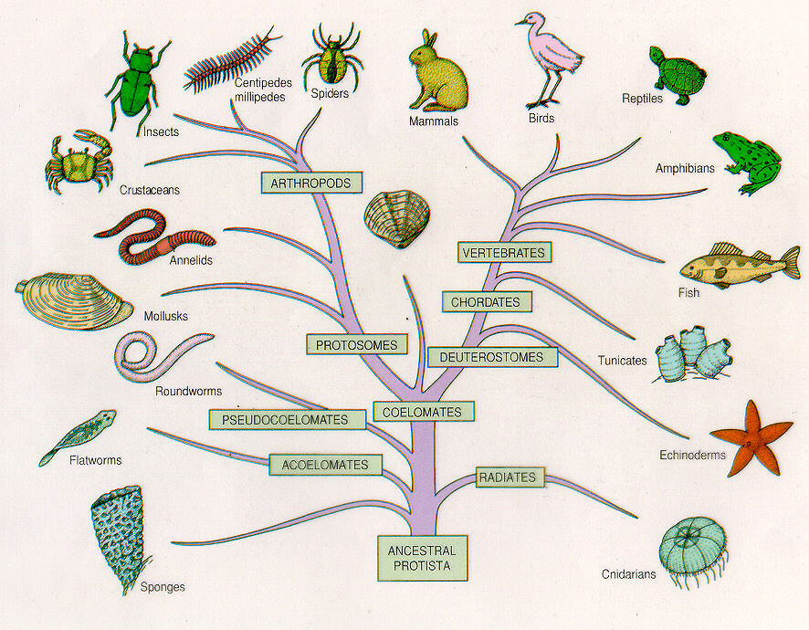

title: "Cuando el Excel no alcanza: Una intro a SQL"
output: index.html
controls: false

--

# Taller de SQL #1
## Una introducción a las bases de datos relacionales


--

### Bases de datos

> Una _base de datos_ es un conjunto de datos pertenecientes a un _mismo contexto_ y _almacenados sistemáticamente_ para su posterior uso.

--

### Bases de datos

> Una _base de datos_ es un conjunto de datos pertenecientes a un _mismo contexto_ y _almacenados sistemáticamente_ para su posterior uso.

  

--

### Bases de datos

> Una _base de datos_ es un conjunto de datos pertenecientes a un _mismo contexto_ y _almacenados sistemáticamente_ para su posterior uso.

  
  

--

### Bases de datos

> Una _base de datos_ es un conjunto de datos pertenecientes a un _mismo contexto_ y _almacenados sistemáticamente_ para su posterior uso.

  
  
  

--

### Bases de datos

> Una _base de datos_ es un conjunto de datos pertenecientes a un _mismo contexto_ y _almacenados sistemáticamente_ para su posterior uso.

  
  
  
  

--

### Bases de datos **Relacionales**
Frank Codd, 1970, IBM Labs: Modelo Relacional

* _Relaciones_ (tablas),
* _Atributos_ (columnas) y
* _Tuplas_ (filas)

_Tuplas_ son los conjuntos de valores que de reemplazarlos por los _atributos_ que componen la _relación_, la vuelven una proposición verdadera.

--

### Ejemplo: Registros en el ReNaPer

* Proposición: Durante el transcurso del año `anio`, el ReNaPer registró `cantidad` personas con el nombre de pila `nombre`.
* Atributos: `anio`, `cantidad`, `nombre`
* Tuplas:
  * (1991, 546, Gonzalo),
  * (1987, 329, Victoria),
  * ...

--

### Ejemplo: Registros en el ReNaPer

 <center> </center>
--

### ¿Qué quiere decir SQL?

SQL , por _Structured Query Language_ ("Lenguaje de Consultas Estructurado"), es la implementación más vieja (y mejor conocida) del Modelo Relacional

Se pronuncia _/esecuele/_ en español, o "sequel" (_/sícuel/_) en inglés.
--

### Historia de SQL

* 1974: se define por primera vez
* 1986: SQL-86, ANSI lo estandariza por primera vez 
* 1992: SQL-92, Segunda estandarización ANSI, la más divulgada

--

### SQL
SQL es un lenguaje de ...
* Definición,
* Control y
* Manipulación

... de datos.

--

### SQL como lenguaje de Definición de Datos
Definición de relaciones y atributos:

```sql
CREATE TABLE maestro_nodup(
	id BIGINT NOT NULL AUTO_INCREMENT,
	anio DATE NOT NULL,
	cantidad INTEGER NOT NULL,
	nombre VARCHAR(100) NOT NULL,
	PRIMARY KEY (id),
	UNIQUE KEY `index_maestro_nodup_on_nombre_anio` (`nombre`, `anio`)
);
```

(¡Próximamente!)

--

### SQL como lenguaje de Control de Datos
Control de acceso a y manipulación de los datos:
```sql
CREATE USER 'gonzalo'@'localhost' IDENTIFIED BY 'seguridad123';
GRANT ALL ON base_renaper.* TO 'gonzalo'@'localhost';
GRANT SELECT ON base_top_secret.info_poderosa TO 'gonzalo'@'localhost';
ALTER USER 'gonzalo'@'localhost' WITH MAX_QUERIES_PER_HOUR 90;
```

* Ojalá nunca les toque.
* Trabajo del _DBA_ (Adm. de Bases de Datos)

--

### SQL como lenguaje de Manipulación de Datos
¡Nuestro plato fuerte!

* `SELECT`
* `FROM`
* `WHERE`
* `GROUP BY`
* `ORDER BY`

--

# ¡Gracias!
## gonzalobb@gmail.com
